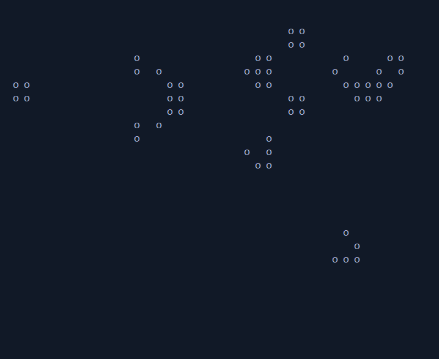

# PyGameOfLife
This is an aproach for conway's Game of Life made in python.

# Usage
Modify the matrices below to set the initial state with 0 (dead cel) or 1 (alive cel).
You can increase or decrease the size of the matrix.